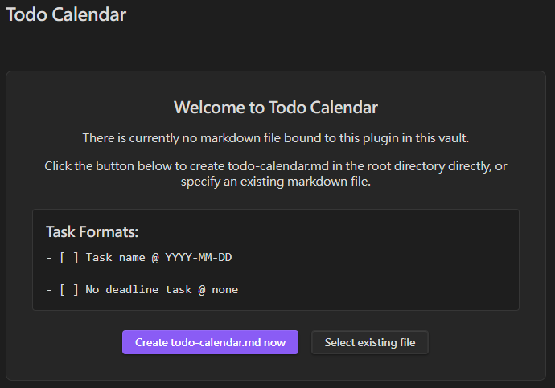
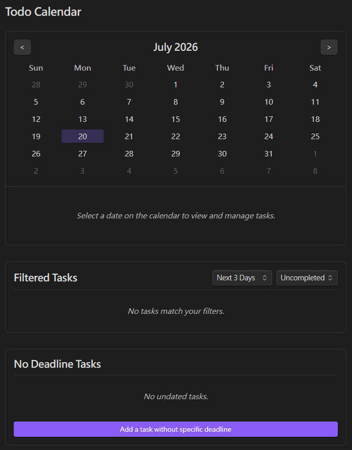

# Obsidian Todo Calendar

English | [繁體中文](README.zh-TW.md)
A visual calendar and timeline view for your Markdown to-do lists in Obsidian.

This plugin transforms your Markdown task list into an intuitive calendar and timeline interface, supporting bi-directional synchronization, internationalization, and a native Obsidian experience.

---

## 📸 Screenshots




---

## 🚀 Features

- **Visual Calendar**: A monthly calendar interface that clearly highlights dates with tasks and their completion status.
- **Bi-directional Sync**: Any creation, modification, deletion, or completion of tasks on the calendar panel is instantly and accurately synced to your Markdown file. Conversely, editing the file externally will update the calendar in real time.
- **Internationalization (i18n)**: Supports English and Traditional Chinese (zh-TW), which can be switched instantly in the settings.
- **Flexible Binding**: Binds to `todo-calendar.md` in the root directory by default, but also supports binding to any Markdown file in your vault via FuzzySearch in the settings menu.
- **Customizable Open Location**: Can be opened in the main workspace or toggled to open in the right sidebar (where backlinks normally reside).
- **Categorization & Filtering**: Built-in filter panels (overdue, next 3 days, next 7 days, etc.) and a dedicated panel for managing tasks with no deadlines.

---

## 🛠️ Usage

1. Enable the plugin and click the **Calendar icon** on the left Ribbon.
2. The system will guide you to create `todo-calendar.md` in the root directory, or you can choose an existing file in the settings.
3. **Task Format**: Use standard Markdown task formatting and append a date tag `@ YYYY-MM-DD`. The calendar will automatically parse them. For example:
   ```markdown
   - [ ] Buy milk @ 2026-07-18
   - [x] Write code @ 2026-07-17
   - [ ] Task with no deadline @ none
   ```

---

## 🧑‍💻 Technical Details & Architecture

This project combines the **Obsidian API** with the **Svelte** framework, ensuring efficient UI updates and stable file I/O through bi-directional data flow.

### 1. Architecture

- `main.ts`: The entry point of the plugin. Responsible for registering the view (`ItemView`), the sidebar icon, Command Palette commands, and the settings interface (`PluginSettingTab`).
- `todo-view.ts`: The core view class that bridges Obsidian and Svelte. Upon `onOpen()`, it instantiates the Svelte app (`App.svelte`) and passes the Obsidian `App` and `Plugin` instances as props.
- `store.ts`: Uses Svelte Stores for global state management, including the task list (`tasksStore`), the currently bound file (`currentFileStore`), and the selected date (`selectedDateStore`).
- `i18n.ts`: A lightweight internationalization system based on Svelte Stores. It uses a `derived` store to automatically respond to language switches, allowing instantaneous UI text updates without reloading the plugin.
- `parser.ts`: Handles all read and write logic for the Obsidian Vault, using regular expressions to parse and accurately modify specific lines within Markdown files.

### 2. Bi-directional Sync Logic

- **From UI to File (Write)**: When the user interacts with the Svelte panel (e.g., clicking a checkbox or adding a task), events are dispatched to trigger write methods in `parser.ts`. We use `app.vault.process()` or direct line-specific read/write operations to modify the physical Markdown file.
- **From File to UI (Read)**: In `App.svelte`, we listen to Obsidian's `app.vault.on("modify", ...)` event to capture external file changes. If the modified file matches the bound `$currentFileStore`, it triggers `loadTasks()` to re-parse the file and push the results to `$tasksStore`, which in turn triggers a Svelte re-render.

### 3. Svelte CSS Scoping

This project does not rely on a massive global `styles.css`. Instead, it fully utilizes Svelte's built-in CSS scoping (Scoped CSS). 
This prevents our custom classes (like `.day-cell`) from conflicting with Obsidian's native themes or other plugins' CSS. Additionally, all colors strictly use Obsidian's native CSS Variables (e.g., `var(--interactive-accent)`), ensuring perfect integration across various light/dark modes or third-party themes.

---

## ⌨️ Local Development

If you want to contribute or run the development environment locally:

1. Clone this repository to your local machine:
   ```bash
   git clone https://github.com/your-username/obsidian-todo-calendar.git
   cd obsidian-todo-calendar
   ```
2. Install dependencies:
   ```bash
   npm install
   ```
3. Start the development compiler in watch mode:
   ```bash
   npm run dev
   ```
   *Note: This will compile the Svelte components and output the final plugin files (`main.js` and `manifest.json`) into the `todo-calendar/` directory.*
4. To test the plugin in Obsidian, copy or symlink the generated `todo-calendar/` folder into your Obsidian vault's plugins folder:
   ```bash
   # macOS / Linux
   ln -s /path/to/cloned/obsidian-todo-calendar/todo-calendar /path/to/your/vault/.obsidian/plugins/todo-calendar

   # Windows (Run Command Prompt as Administrator)
   mklink /D "C:\path\to\your\vault\.obsidian\plugins\todo-calendar" "C:\path\to\cloned\obsidian-todo-calendar\todo-calendar"
   ```
5. Refresh your Obsidian plugins list and enable "Todo Calendar".

---

## 📄 License

This project is licensed under the MIT License - see the [LICENSE](LICENSE) file for details.
